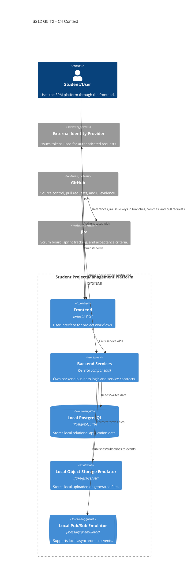
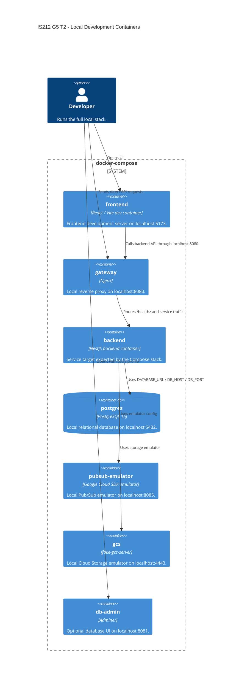

# IS212-G5-T2

Student Project Management workspace for IS212 G5 T2. This repository documents the shared project context, workspace setup, architecture direction, contributor expectations, and the team's Jira/GitHub workflow.

This repository contains the project code, local development setup, and GitHub Actions workflows in one GitHub repository. Deployment, Terraform, and Kubernetes platform configuration have been removed.

```text
.
|-- .github/              # GitHub metadata, pull request template, and workflows
|-- assets/               # README and documentation images
|-- backend/              # NestJS backend service
|-- database/             # Local database image and initialization assets
|-- docs/                 # Project workflow documentation
|-- docker-compose/       # Local Docker Compose integration stack
|-- frontend/             # React/Vite frontend application
|-- AGENTS.md             # Agent working instructions
|-- AI_USAGE.md           # AI-assisted work log
`-- opencode.json
```

## Project Context

The project is structured as a Student Project Management workspace. The intended application architecture separates the client, backend services, local development environment, CI workflows, and process documentation into clear top-level areas.

At a high level:

- `frontend` is the React/Vite frontend application.
- `backend` is the NestJS backend service.
- `docker-compose` owns the Docker Compose environment for local integration testing.
- `database` owns the local PostgreSQL image and initialization assets used by Compose.
- `.github/workflows` owns the GitHub Actions security and test workflows.
- `docs` owns project workflow documentation.

No deployment target is defined in this repository. `dev` is the latest shared branch; create new work branches from the latest `dev` and open pull requests back into `dev`.


## Setup

### System Architecture

The system is organized around clear ownership boundaries:

| Layer | Repository | Responsibility |
| --- | --- | --- |
| Project coordination | Repository root and `docs` | README, AI usage notes, agent instructions, project workflow documentation |
| Frontend | `frontend` | React/Vite user-facing client application, frontend package scripts, and frontend Dockerfile |
| Backend service | `backend` | NestJS backend service code, service-specific tests, service Dockerfile, and service CI entrypoint |
| Database assets | `database` | Local PostgreSQL image and initialization assets used by Docker Compose |
| Local integration | `docker-compose` | Docker Compose frontend/backend runtime targets and PostgreSQL |
| CI | `.github/workflows` | GitHub Actions workflows for security and tests |

The local development stack supports integration work without deployment infrastructure:

| Local concern | Local implementation |
| --- | --- |
| Compose network | `spm` |
| Local gateway | Nginx gateway at `http://localhost:8080` |
| Frontend container | `frontend` container at `http://localhost:5173` |
| Backend container | `backend` container through the gateway at `http://localhost:8080` |
| PostgreSQL | PostgreSQL at `localhost:5432` |
| Object storage emulator | Fake GCS server at `http://localhost:4443` |
| Pub/Sub emulator | Pub/Sub emulator at `localhost:8085` |
| Runtime configuration | `.env` file |
| Service readiness | Docker Compose health checks |

### C4 Diagram





### How To Actually Run The Whole Project

Run commands from the repository root:

```sh
cd IS212-G5-T2
```

Make sure you have:

- Git installed.
- Docker Desktop or Docker Engine with Docker Compose.
- Access to this GitHub repository.
- GitHub authentication configured locally through SSH and/or HTTPS credentials.
- Optional but recommended: GitHub CLI (`gh`) authenticated against `github.com`.

Before cloning, configure GitHub access. The team manual standardizes on an ed25519 SSH key:

```sh
chmod 700 ~/.ssh
ssh-keygen -t ed25519 -C "your_email@example.com" -f ~/.ssh/id_ed25519_github
chmod 600 ~/.ssh/id_ed25519_github
chmod 644 ~/.ssh/id_ed25519_github.pub
```

Add this to `~/.ssh/config`:

```text
Host github.com
HostName github.com
User git
IdentityFile ~/.ssh/id_ed25519_github
IdentitiesOnly yes
```

Start the SSH agent and add the key:

```sh
eval "$(ssh-agent -s)"
ssh-add ~/.ssh/id_ed25519_github
chmod 600 ~/.ssh/config
```

Copy the public key and add it in GitHub under **Settings > SSH and GPG keys**:

```sh
cat ~/.ssh/id_ed25519_github.pub
```

On macOS, copy directly to the clipboard:

```sh
cat ~/.ssh/id_ed25519_github.pub | pbcopy
```

Test the SSH connection:

```sh
ssh -T git@github.com
```

For Windows PowerShell, generate and add the same key name:

```powershell
ssh-keygen -t ed25519 -C "your_email@example.com" -f "$HOME\.ssh\id_ed25519_github"
notepad "$HOME\.ssh\config"
Start-Service ssh-agent
Set-Service ssh-agent -StartupType Automatic
ssh-add "$HOME\.ssh\id_ed25519_github"
Get-Content "$HOME\.ssh\id_ed25519_github.pub" | Set-Clipboard
```

To run the local development stack, move into the Compose environment:

```sh
cd docker-compose
cp .env.example .env
docker compose up --build
```

Check the gateway:

```sh
curl http://localhost:8080/healthz
```

Common local URLs:

| Service | URL |
| --- | --- |
| Frontend | `http://localhost:5173` |
| Local gateway | `http://localhost:8080` |
| Backend through gateway | `http://localhost:8080/healthz` |
| PostgreSQL | `localhost:5432` |
| Pub/Sub emulator | `localhost:8085` |
| Storage emulator | `http://localhost:4443` |
| Adminer, optional | `http://localhost:8081` |

Start Adminer only when needed:

```sh
docker compose --profile tools up db-admin
```

Use these Adminer values:

| Field | Value |
| --- | --- |
| System | `PostgreSQL` |
| Server | `postgres` |
| Username | `spm` |
| Password | `spm_dev_password` |
| Database | `spm` |

Stop the local stack without deleting data:

```sh
docker compose down
```

Reset local database and storage volumes only when a full data reset is intended:

```sh
docker compose down -v
```

The local Compose stack builds `../frontend` for the frontend container, `../backend` for the backend container, and `../database/postgresql` for the local PostgreSQL image.

## Developers

Current contributors visible in this repository history:

- JacobSoh
- Wei Rong

Team members should keep GitHub author names, Jira assignees, and pull request reviewers aligned so ownership is visible across Jira, GitHub, and sprint review evidence.

## Jira Workflow Mentality

### Scrum Process Using Jira

The team uses Jira as the source of truth for Scrum planning and delivery tracking. Work should begin in Jira before it becomes code.

Our Jira mentality:

- Epics describe larger product or platform outcomes.
- User stories describe user-facing value and should include acceptance criteria.
- Tasks break implementation work into manageable technical steps.
- Bugs capture defects, regressions, or failed acceptance criteria.
- Sprint boards show current work, ownership, blockers, and review status.
- Every branch, commit, and pull request should reference the Jira issue key when one exists.
- Acceptance criteria should drive implementation, testing, and pull request evidence.
- Work is not considered done just because code is pushed; it is done when the Jira item, code review, CI checks, and acceptance criteria are all satisfied.

A typical Scrum flow:

1. Product or platform work is captured as an epic, story, task, or bug in Jira.
2. The team refines the issue until scope and acceptance criteria are clear.
3. The issue is pulled into a sprint and assigned.
4. A developer creates a branch using the Jira key.
5. The developer implements the work, updates tests and documentation, and opens a GitHub pull request.
6. CI evidence, review feedback, and acceptance criteria are checked before merging.
7. Jira automation reflects branch creation, pull request review, and post-merge testing status.

### Branch Flow: Work Branch To dev

The team uses `dev` as the latest shared branch:

```text
feature/fix/docs branch
        |
        v
dev
```

Recommended branch names:

```text
feature/<ticket_id>-<ticket_name>
fix/<ticket_id>-<ticket_name>
docs/<ticket_id>-<ticket_name>
chore/<ticket_id>-<ticket_name>
```

Use the Jira ticket id, such as `SPM-155`, followed by a hyphenated slug of the Jira ticket name. This keeps the connected Jira and GitHub work easy to recognize from either tool.

#### 1. Feature, Fix, Docs, Or Chore Branch

This is where individual development happens.

- Created from the latest `dev`.
- Named with the Jira key whenever available.
- Contains focused commits for one Jira issue or one tightly related change.
- Developer runs relevant local checks before opening a pull request.
- Pull request explains the change, links the Jira issue, lists tests, and calls out risks or follow-up work.

#### 2. dev

`dev` is the latest shared branch for the project.

- Feature branches merge here after review.
- GitHub Actions should run unit tests on `dev`.
- GitHub Actions should catch security and unit-test problems on `dev`.
- The team resolves merge conflicts and cross-service incompatibilities here.
- Bugs found on `dev` should be fixed from a new branch based on the latest `dev`.
- Jira issues should only be marked done when the implementation, review, CI, and acceptance criteria are complete.

The goal of this workflow is to keep Scrum planning, code review, and CI evidence connected. Jira explains why the work exists; GitHub proves what changed; CI shows whether the change is safe to merge into `dev`.
