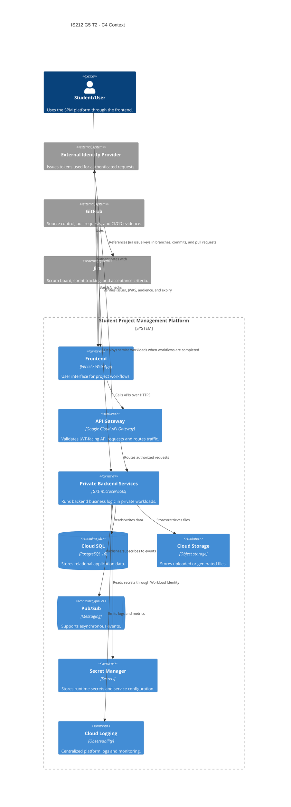
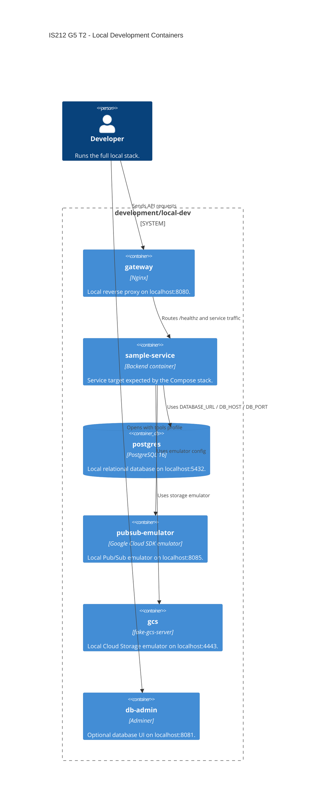

# IS212-G5-T2

Student Project Management platform workspace for IS212 G5 T2. This repository documents the shared project context, workspace setup, architecture direction, contributor expectations, and the team's Jira/GitHub workflow.

This repository now contains the project code, infrastructure configuration, local development setup, and GitHub Actions workflows in one GitHub repository.

```text
.
|-- .github/              # GitHub metadata, pull request template, and workflows
|-- apps/                 # Front-facing applications
|-- assets/               # README and documentation images
|-- development/          # Local development and integration tooling
|-- docs/                 # Project workflow documentation
|-- platform/             # Terraform and Kubernetes platform configuration
|-- services/             # Backend-facing services and service template
|-- AGENTS.md             # Agent working instructions
|-- AI_USAGE.md           # AI-assisted work log
`-- opencode.json
```

## Project Context

The project is structured as a Student Project Management platform workspace. The intended application architecture separates the client, backend services, local development environment, CI/CD workflows, Kubernetes runtime configuration, and Google Cloud infrastructure into clear top-level areas.

At a high level:

- `apps/frontend` is the frontend application area. It is currently a scaffold with documentation; application setup, test, and build commands have not been added yet.
- `services/template` is the baseline service template used when creating new backend services.
- `development/local-dev` owns the Docker Compose environment for local integration testing.
- `platform/terraform` owns the Google Cloud foundation, including networking, GKE, Artifact Registry, Secret Manager, Cloud SQL, Pub/Sub, Cloud Storage, API Gateway variables, IAM, Workload Identity, and observability.
- `platform/kubernetes` owns the Kubernetes runtime layer, including namespace, service accounts, Gateway API routing, service manifests, health policies, autoscaling, resource quotas, and network policy.
- `.github/workflows` owns the GitHub Actions CI/CD workflows.
- `docs` owns project workflow documentation.

The target deployment architecture is a Vercel-hosted frontend communicating with authenticated backend APIs through Google Cloud API Gateway. API Gateway performs JWT-facing checks and forwards requests to workloads running in a private GKE cluster. Backend services use managed Google Cloud services such as Cloud SQL, Pub/Sub, Cloud Storage, Secret Manager, Artifact Registry, and centralized logging.


## Setup

### System Architecture

The system is organized around clear ownership boundaries:

| Layer | Repository | Responsibility |
| --- | --- | --- |
| Project coordination | Repository root and `docs` | README, AI usage notes, agent instructions, project workflow documentation |
| Frontend | `apps/frontend` | User-facing client application scaffold and frontend CI security checks |
| Backend services | `services/*` | Microservice code, service-specific tests, service Dockerfiles, service CI |
| Local integration | `development/local-dev` | Docker Compose gateway, sample service runtime target, PostgreSQL, Pub/Sub emulator, fake GCS, Adminer |
| Cloud infrastructure | `platform/terraform` | GCP foundation, IAM, networking, GKE, managed services, observability |
| Runtime manifests | `platform/kubernetes` | Kubernetes namespace, Gateway API resources, Deployments, Services, HPA, health policies |
| CI/CD | `.github/workflows` | GitHub Actions workflows for security, tests, Terraform, and deployment |

The local development stack mirrors the intended cloud platform closely enough for integration work:

| Cloud or Kubernetes resource | Local equivalent |
| --- | --- |
| GKE namespace `spm` | Docker Compose network `spm` |
| GKE Gateway and HTTPRoute | Nginx gateway at `http://localhost:8080` |
| Microservice Deployment | `sample-service` container |
| Cloud SQL for PostgreSQL 16 | PostgreSQL at `localhost:5432` |
| Cloud SQL Auth Proxy sidecar | Direct Compose DNS name `postgres` |
| Cloud Storage bucket | Fake GCS server at `http://localhost:4443` |
| Pub/Sub topic and subscription | Pub/Sub emulator at `localhost:8085` |
| Secret Manager and ConfigMap | `.env` file |
| Kubernetes probes | Docker Compose health checks |

### C4 Diagram





### How To Actually Run The Whole Project

Run commands from the repository root:

```sh
cd IS212-G5-T2
```

Make sure you have:

- Git installed.
- Docker Desktop or Docker Engine with Docker Compose.
- Access to this GitHub repository.
- GitHub authentication configured locally through SSH and/or HTTPS credentials.
- Optional but recommended: GitHub CLI (`gh`) authenticated against `github.com`.

Before cloning, configure GitHub access. The team manual standardizes on an ed25519 SSH key:

```sh
chmod 700 ~/.ssh
ssh-keygen -t ed25519 -C "your_email@example.com" -f ~/.ssh/id_ed25519_github
chmod 600 ~/.ssh/id_ed25519_github
chmod 644 ~/.ssh/id_ed25519_github.pub
```

Add this to `~/.ssh/config`:

```text
Host github.com
HostName github.com
User git
IdentityFile ~/.ssh/id_ed25519_github
IdentitiesOnly yes
```

Start the SSH agent and add the key:

```sh
eval "$(ssh-agent -s)"
ssh-add ~/.ssh/id_ed25519_github
chmod 600 ~/.ssh/config
```

Copy the public key and add it in GitHub under **Settings > SSH and GPG keys**:

```sh
cat ~/.ssh/id_ed25519_github.pub
```

On macOS, copy directly to the clipboard:

```sh
cat ~/.ssh/id_ed25519_github.pub | pbcopy
```

Test the SSH connection:

```sh
ssh -T git@github.com
```

For Windows PowerShell, generate and add the same key name:

```powershell
ssh-keygen -t ed25519 -C "your_email@example.com" -f "$HOME\.ssh\id_ed25519_github"
notepad "$HOME\.ssh\config"
Start-Service ssh-agent
Set-Service ssh-agent -StartupType Automatic
ssh-add "$HOME\.ssh\id_ed25519_github"
Get-Content "$HOME\.ssh\id_ed25519_github.pub" | Set-Clipboard
```

To run the local development stack, move into the Compose environment:

```sh
cd development/local-dev
cp .env.example .env
docker compose up --build
```

Check the gateway:

```sh
curl http://localhost:8080/healthz
```

Common local URLs:

| Service | URL |
| --- | --- |
| Local gateway | `http://localhost:8080` |
| Sample service through gateway | `http://localhost:8080/healthz` |
| PostgreSQL | `localhost:5432` |
| Pub/Sub emulator | `localhost:8085` |
| Storage emulator | `http://localhost:4443` |
| Adminer, optional | `http://localhost:8081` |

Start Adminer only when needed:

```sh
docker compose --profile tools up db-admin
```

Use these Adminer values:

| Field | Value |
| --- | --- |
| System | `PostgreSQL` |
| Server | `postgres` |
| Username | `spm` |
| Password | `spm_dev_password` |
| Database | `spm` |

Stop the local stack without deleting data:

```sh
docker compose down
```

Reset local database and storage volumes only when a full data reset is intended:

```sh
docker compose down -v
```

Important current limitation: `development/local-dev/compose.yaml` currently builds `../../services/sample-service`, but this checkout does not currently contain `services/sample-service`. The stack will not fully build until that service exists or the Compose build context is changed to point at an implemented service. The frontend repository is also currently a scaffold, so there is no frontend application install/start command yet.

## Developers

Current contributors visible in this repository history:

- JacobSoh
- Wei Rong

Team members should keep GitHub author names, Jira assignees, and pull request reviewers aligned so ownership is visible across Jira, GitHub, and sprint review evidence.

## Jira Workflow Mentality

### Scrum Process Using Jira

The team uses Jira as the source of truth for Scrum planning and delivery tracking. Work should begin in Jira before it becomes code.

Our Jira mentality:

- Epics describe larger product or platform outcomes.
- User stories describe user-facing value and should include acceptance criteria.
- Tasks break implementation work into manageable technical steps.
- Bugs capture defects, regressions, or failed acceptance criteria.
- Sprint boards show current work, ownership, blockers, and review status.
- Every branch, commit, and pull request should reference the Jira issue key when one exists.
- Acceptance criteria should drive implementation, testing, and pull request evidence.
- Work is not considered done just because code is pushed; it is done when the Jira item, code review, CI checks, and acceptance criteria are all satisfied.

A typical Scrum flow:

1. Product or platform work is captured as an epic, story, task, or bug in Jira.
2. The team refines the issue until scope and acceptance criteria are clear.
3. The issue is pulled into a sprint and assigned.
4. A developer creates a branch using the Jira key.
5. The developer implements the work, updates tests and documentation, and opens a GitHub pull request.
6. CI evidence, review feedback, and acceptance criteria are checked before merging.
7. Jira is updated as the work moves from in progress to review, staging validation, and done.

### Branch Flow: Branch To Integration To Staging To Main

The team follows a controlled branch promotion flow:

```text
feature/fix/docs branch
        |
        v
integration
        |
        v
staging
        |
        v
main
```

Recommended branch names:

```text
feature/<JIRA-KEY>-<short-description>
fix/<JIRA-KEY>-<short-description>
docs/<JIRA-KEY>-<short-description>
chore/<JIRA-KEY>-<short-description>
```

#### 1. Feature, Fix, Docs, Or Chore Branch

This is where individual development happens.

- Created from the latest appropriate base branch.
- Named with the Jira key whenever available.
- Contains focused commits for one Jira issue or one tightly related change.
- Developer runs relevant local checks before opening a pull request.
- Pull request explains the change, links the Jira issue, lists tests, and calls out risks or follow-up work.

#### 2. Integration

`integration` is the first shared branch for combining active team work.

- Feature branches merge here after review.
- CI should catch obvious security, unit-test, and integration problems early.
- GitHub Actions should catch security, unit-test, and integration problems on `integration`.
- The team resolves merge conflicts and cross-service incompatibilities here.
- Jira items can move into review or integrated status once the pull request is accepted and evidence is attached.

#### 3. Staging

`staging` represents a release-candidate environment.

- Only integrated, reviewed, and testable work should be promoted here.
- The team validates that the application, services, and platform areas still work together as a release candidate.
- GitHub Actions should run unit tests on `staging`.
- Terraform workflows should run `terraform fmt`, `terraform validate`, and `terraform plan` on `staging`.
- Bugs found during staging should go back through a fix branch and integration before being promoted again.

#### 4. Main

`main` is the production-ready branch.

- Only staging-validated work should reach `main`.
- Production deployment jobs or placeholders run from this branch.
- Terraform `apply` and `destroy` jobs are manual on `main`.
- Release notes, changelog updates, and handover notes should be completed before or with promotion to `main`.
- Jira issues should only be marked done when the implementation, review, CI, staging validation, and documentation expectations are complete.

The goal of this workflow is to keep Scrum planning, code review, CI evidence, and deployment readiness connected. Jira explains why the work exists; GitHub proves what changed; CI shows whether the change is safe to promote.
